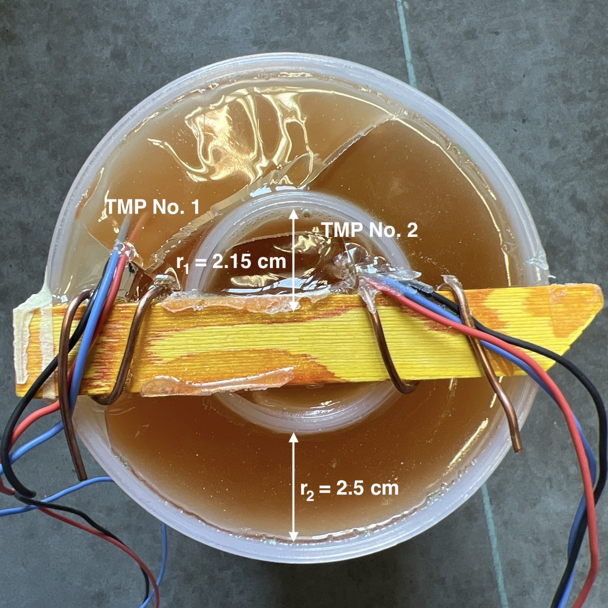
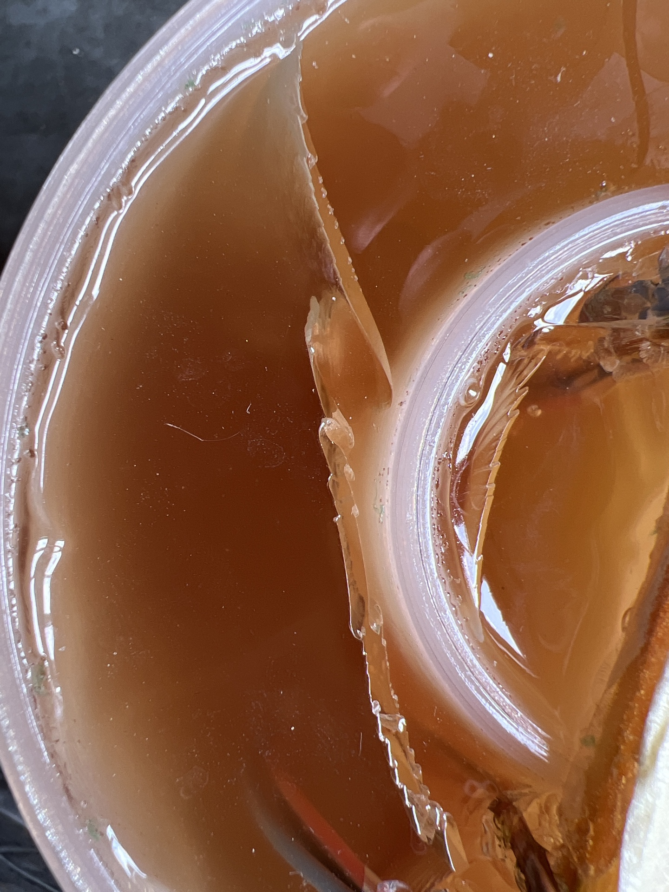
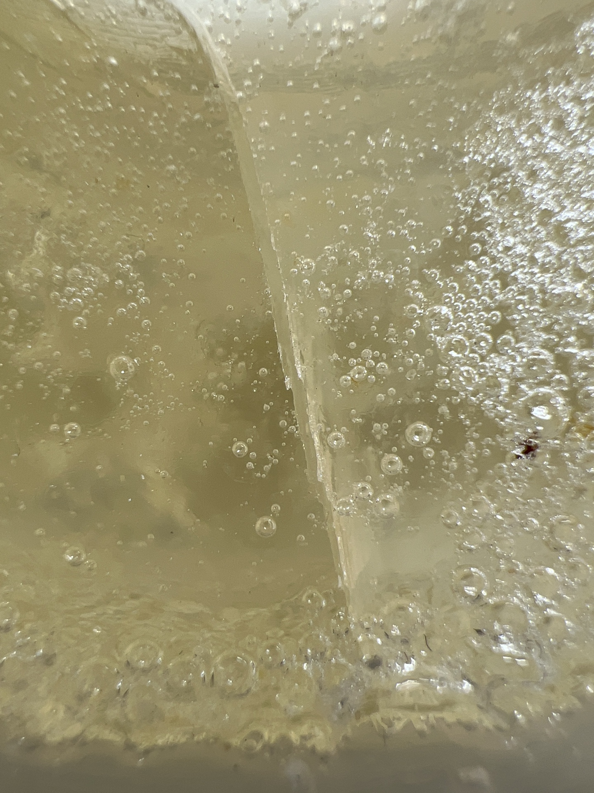

```{=html}
<style>
body {
text-align: justify;font-size: 17spx; line-height: 1.75em}
  }
</style>
```
```{=html}
<style>
#TOC {
  background: url("https://www.quintessa.org/pictures/news_388.jpg");
  background-size: contain;
  padding-top: 250px !important;
  background-repeat: no-repeat;
}
</style>
```
## Introduction

The aim of this pretest for the CL-Experiment (CO~2~ long-term periodic injection experiment) was to find out how the temperature of two synthetic resins behave over time in a borehole.

## Material & Methods

### Experimental Setup

For this resin pretest, double-walled cylinders (r~1~ = 2.15 cm, r~2~ = 2.5 cm, 17 cm high, 325.5 g) made of poly-amide were used and bedded on sand. The two resins and their corresponding hardener (Sikadur-52 and Biresin CR83 & CH83-10) were mixed at a ambient temperature of 10 °C. The resins poured from a height of 2.5 m through a plastic tube (diameter 1 cm) once in both annuli (1 L + 0.25 L) and once in the outer annulus (1 L) into the prepared forms (Figure 1). The temperature was measured with TMP35 sensors (Analog Devices, USA) attached to temperature-resistant silicone cable (wire size 0.25 mm^2^, Helukabel, Switzerland) (Figure 2). When both annuli have been filled, the temperature sensors were placed inside and outside respectively at a height of 9 cm. If only the outer annulus was filled, the temperature sensors were placed at a height of 6 (lower third) and 12 cm (higher third) respectively. The data logging was done every 6 seconds with a WioTerminal (Seeed Technology, China). The data logging and processing code was written with Arduino IDE (version 2.1.0). The data analysis was done with R (version 4.2.2) and RStudio (version 2023.03.0+386).

<center>

{width="300"} {width="300"}

<font size = "2"> **Figure 1:** **a)** Overview of the experimental setup and **b)** close-up of resin filling. </font>

{width="300"}

<font size = "2"> **Figure 2:** Double-walled poly-amide cylinders (r~1~ = 2.15 cm, r~2~ = 2.5 cm, 17 cm high, 325.5 g) filled with Sikadur-52 resin in both annuli. TMP35 sensor No. 1 in the outer annulus and TMP35 sensor No. 3 in the inner annulus. </font>

</center>

### Loading Libraries and Import Data-Set

The data were imported as txt. files. The sensor numbers were then converted to a factor (`as.factor()`, package "base") and the time was transformed to a date-time format (`dmy_hms()`, package "lubridate"). The time since the start of the experiment was also added (`difftime()`, package "base"). The packages "ggplot2", "ggpmisc" and "ggprism" were used to create the diagrams.

```{r setup, message=FALSE, warning=FALSE}

library(lubridate)
library(dplyr)
library(ggplot2)
library(ggpmisc)
library(ggprism)

Sikadur_raw <- read.csv("Experiment1_Sikadur.txt", sep = ";", header = T, col.names = c("Time","Sensor_No","Analog_Read","Voltage_mV","Temperature_degC"))

Sikadur_both_annulus <- Sikadur_raw %>%
  mutate(Sensor_No = as.factor(Sensor_No)) %>%
  mutate(Time = dmy_hms(Time)) %>%
  mutate(Time_since_Start = difftime(time1 = Time, time2 = min(Time), units = "hours")) %>%
  filter(Sensor_No == 1 | Sensor_No == 3)

Sikadur_outer_annulus <- Sikadur_raw %>%
  mutate(Sensor_No = as.factor(Sensor_No)) %>%
  mutate(Time = dmy_hms(Time)) %>%
  filter(Time >= "2023-06-07 15:00:00") %>%
  mutate(Time_since_Start = difftime(time1 = Time, time2 = min(Time), units = "hours")) %>%
  filter(Sensor_No == 2 | Sensor_No == 4)


Biresin_raw <- read.csv("Experiment2_Biresin.txt", sep = ";", header = T, col.names = c("Time","Sensor_No","Analog_Read","Voltage_mV","Temperature_degC"))

Biresin_both_annulus <- Biresin_raw %>%
  mutate(Sensor_No = as.factor(Sensor_No)) %>%
  mutate(Time = dmy_hms(Time)) %>%
  mutate(Time_since_Start = difftime(time1 = Time, time2 = min(Time), units = "hours")) %>%
  filter(Sensor_No == 1 | Sensor_No == 3)

Biresin_outer_annulus <- Biresin_raw %>%
  mutate(Sensor_No = as.factor(Sensor_No)) %>%
  mutate(Time = dmy_hms(Time)) %>%
  filter(Time >= "2023-06-07 15:00:00") %>%
  mutate(Time_since_Start = difftime(time1 = Time, time2 = min(Time), units = "hours")) %>%
  filter(Sensor_No == 2 | Sensor_No == 4)

```

## Results

### Sikadur

When both annuli have been filled, the temperature reached its maximum after one hour and was at 142°C (inner annulus) and 134°C (outer annulus) respectively (Figure 3). To fill the cylinder completely with the resin, 13 minutes were needed. The viscosity of the Sikadur slowly increased after 15 minutes and became solid after 1 hours. From this moment on, there was minimal smoke development for about 4 minutes. Some stress cracks formed (Figure 4). The volume of initially 1.25 L decreased by 20 mL (-1.6 %). The axial diameter remained unchanged at r~1~ = 2.15 cm cm and r~1~ = 2.5 cm respectively.

```{r message=FALSE, warning=FALSE, paged.print=TRUE, fig.align="center"}

Sikadur_both_annulus_Plot <- ggplot(data = Sikadur_both_annulus, mapping = aes(x = Time_since_Start, y = Temperature_degC, colour = Sensor_No)) +
  geom_line(linewidth = 1.25) +
  theme_classic() +
  theme(axis.title.y = element_text(margin = margin(r = 15)), 
        axis.title.x = element_text(margin = margin(t = 10)), 
        axis.text= element_text(colour="black")) +
  xlab("Time [h]") +
  ylab(expression("Temperature [°C]")) +
  scale_x_continuous(guide = "prism_minor", 
                             limits = c(0, 16),
                             expand = c(0, 0),
                             minor_breaks = seq(0, 16, 2)) +
  scale_y_continuous(limits = c(0,160), breaks = seq(0, 160, 10), expand = c(0,0)) +
  labs(caption = "Jonas M. Windisch, Mont Terri Rock Lab, swisstopo") +
  theme(legend.position = c(0.9, 0.5)) +
  guides(color = guide_legend(title = "Temperatur Sensors")) +
  scale_color_manual(labels = c("No. 1 (outer annulus)", "No. 3 (inner annulus)"),
                     values = c("darkolivegreen3","royalblue1")) +
  ggtitle("Sikadur-52 (both annulus filled)") +
  stat_peaks(span = NULL,
             geom = "text_s",
             mapping = aes(label = paste(after_stat(y.label), after_stat(x.label))),
             x.label.fmt = "after %.0f hrs ",
             y.label.fmt = " Max Temp. of %.0f°C",
             arrow = grid::arrow(length = unit(0.3, "cm")),
             position = position_nudge_keep(x = c(0.5, 0.25),  y = c(5, 10)),
             hjust = 0)
  
Sikadur_both_annulus_Plot

ggsave(filename = "Sikadur_both_annulus.pdf", plot = Sikadur_both_annulus_Plot, width = 25, height = 10, units = "cm", dpi = 1100)

Sikadur_both_annulus_Plot_transparent <- Sikadur_both_annulus_Plot + theme(legend.background = element_rect(fill = "transparent"),
        legend.box.background = element_rect(fill = "transparent"),
        panel.background = element_rect(fill = "transparent"),
        plot.background = element_rect(fill = "transparent",
                                       color = NA))
ggsave(Sikadur_both_annulus_Plot_transparent, filename = "Sikadur_both_annulus_transparent.png", bg = "transparent")

```

<center><font size = "2"> **Figure 3:** Temperature curve of the Sikadur-52 resin (both annuli filled) measured every 6 seconds over 16 hours. </font><br>

{width="300"}

<font size = "2"> **Figure 4:** Close-up image of stress cracks in Sikadur-52 resin (both annuli filled). </font></center><br>

If only the inner annulus has been filled, the temperature reached its maximum after one hour and was at 130°C (lower third) and 114°C (higher third) respectively (Figure 5). To fill the cylinder completely with the resin, 11 minutes were needed. The viscosity of the Sikadur slowly increased after 15 hours and became solid after 1 hours. From this moment on, there was minimal smoke development for about 3 minutes. Some stress cracks formed. The volume of initially 0.8 L decreased by 20 mL (-2.5 %). The axial diameter remained unchanged.

```{r message=FALSE, warning=FALSE, paged.print=TRUE, fig.align="center"}

Sikadur_outer_annulus_Plot <- ggplot(data = Sikadur_outer_annulus, mapping = aes(x = Time_since_Start, y = Temperature_degC, colour = Sensor_No)) +
  geom_line(linewidth = 1.25) +
  theme_classic() +
  theme(axis.title.y = element_text(margin = margin(r = 15)), 
        axis.title.x = element_text(margin = margin(t = 10)), 
        axis.text= element_text(colour="black")) +
  xlab("Time [h]") +
  ylab(expression("Temperature [°C]")) +
  scale_x_continuous(guide = "prism_minor", 
                             limits = c(0, 16),
                             expand = c(0, 0),
                             minor_breaks = seq(0, 16, 2)) +
  scale_y_continuous(limits = c(0,160), breaks = seq(0, 160, 10), expand = c(0,0)) +
  labs(caption = "Jonas M. Windisch, Mont Terri Rock Lab, swisstopo") +
  theme(legend.position = c(0.9, 0.5)) +
  guides(color = guide_legend(title = "Temperatur Sensors")) +
  scale_color_manual(labels = c("No. 2 (lower third)", "No. 4 (upper third)"),
                     values = c("darkolivegreen3","royalblue1")) +
  ggtitle("Sikadur-52 (outer annulus filled)") +
  stat_peaks(span = NULL,
             geom = "text_s",
             mapping = aes(label = paste(after_stat(y.label), after_stat(x.label))),
             x.label.fmt = "after %.0f hrs ",
             y.label.fmt = " Max Temp. of %.0f°C",
             arrow = grid::arrow(length = unit(0.3, "cm")),
             position = position_nudge_keep(x = c(0.5, 0.25),  y = c(5, 10)),
             hjust = 0)
  
Sikadur_outer_annulus_Plot

ggsave(filename = "Sikadur_outer_annulus.pdf", plot = Sikadur_outer_annulus_Plot, width = 25, height = 10, units = "cm", dpi = 1100)

Sikadur_outer_annulus_Plot_transparent <- Sikadur_outer_annulus_Plot + theme(legend.background = element_rect(fill = "transparent"),
        legend.box.background = element_rect(fill = "transparent"),
        panel.background = element_rect(fill = "transparent"),
        plot.background = element_rect(fill = "transparent",
                                       color = NA))
ggsave(Sikadur_outer_annulus_Plot_transparent, filename = "Sikadur_outer_annulus_transparent.png", bg = "transparent")

```

<center><font size = "2"> **Figure 5:** Temperature curve of the Sikadur-52 resin (outer annulus filled) measured every 6 seconds over 16 hours. </font></center>

### Biresin

When both annuli have been filled, the temperature reached its maximum after 8 to 9 hours and was at 145°C (inner annulus) and 144°C (outer annulus) respectively (Figure 6). To fill the cylinder completely with the resin, 7 minutes were needed. The viscosity of the Biresin slowly increased after 6 hours and became solid after 8 hours. From this moment on, there was minimal smoke development for about 3 minutes. Some stress cracks formed (Figure 7). The volume of initially 1.25 L decreased by 50 mL (-4 %). The axial diameter remained unchanged.

```{r message=FALSE, warning=FALSE, paged.print=TRUE, fig.align="center"}

Biresin_both_annulus_Plot <- ggplot(data = Biresin_both_annulus, mapping = aes(x = Time_since_Start, y = Temperature_degC, colour = Sensor_No)) +
  geom_line(linewidth = 1.25) +
  theme_classic() +
  theme(axis.title.y = element_text(margin = margin(r = 15)), 
        axis.title.x = element_text(margin = margin(t = 10)), 
        axis.text= element_text(colour="black")) +
  xlab("Time [h]") +
  ylab(expression("Temperature [°C]")) +
  scale_x_continuous(guide = "prism_minor", 
                             limits = c(0, 16),
                             expand = c(0, 0),
                             minor_breaks = seq(0, 16, 2)) +
  scale_y_continuous(limits = c(0,160), breaks = seq(0, 160, 10), expand = c(0,0)) +
  labs(caption = "Jonas M. Windisch, Mont Terri Rock Lab, swisstopo") +
  theme(legend.position = c(0.25, 0.5)) +
  guides(color = guide_legend(title = "Temperatur Sensors")) +
  scale_color_manual(labels = c("No. 1 (outer annulus)", "No. 3 (inner annulus)"),
                     values = c("darkolivegreen3","royalblue1")) +
  ggtitle("Biresin CR83 & CH83-10 (both annulus filled)") +
  stat_peaks(span = NULL,
             geom = "text_s",
             mapping = aes(label = paste(after_stat(y.label), after_stat(x.label))),
             x.label.fmt = "after %.0f hrs ",
             y.label.fmt = " Max Temp. of %.0f°C",
             arrow = grid::arrow(length = unit(0.3, "cm")),
             position = position_nudge_center(x = c(-0.5, -0.25),  y = c(-4, 6)),
             hjust = 1)
  
Biresin_both_annulus_Plot

ggsave(filename = "Biresin_both_annulus.pdf", plot = Biresin_both_annulus_Plot, width = 25, height = 10, units = "cm", dpi = 1100)

Biresin_both_annulus_Plot_transparent <- Biresin_both_annulus_Plot + theme(legend.background = element_rect(fill = "transparent"),
        legend.box.background = element_rect(fill = "transparent"),
        panel.background = element_rect(fill = "transparent"),
        plot.background = element_rect(fill = "transparent",
                                       color = NA))
ggsave(Biresin_both_annulus_Plot_transparent, filename = "Biresin_both_annulus_transparent.png", bg = "transparent")

```

<center><font size = "2"> **Figure 6:** Temperature curve of the Biresin CR83 & CH83-10 resin (both annuli filled) measured every 6 seconds over 16 hours. </font><br>

{width="300"}

<font size = "2"> **Figure 7:** Close-up image of stress cracks in Biresin CR83 & CH83-10 resin (both annuli filled). </font></center><br>

If only the inner annulus has been filled, the temperature reached its maximum after 11 hours and was at 113°C (lower third) and 91°C (higher third) respectively (Figure 8). To fill the cylinder completely with the resin, 4 minutes were needed. The viscosity of the Biresin slowly increased after 6 hours and became solid after 8 hours. From this moment on, there was minimal smoke development for about 2 minutes. Some stress cracks formed. The volume of initially 1 L decreased by 60 mL (-6 %). The axial diameter remained unchanged.

```{r message=FALSE, warning=FALSE, paged.print=TRUE, fig.align="center"}

Biresin_outer_annulus_Plot <- ggplot(data = Biresin_outer_annulus, mapping = aes(x = Time_since_Start, y = Temperature_degC, colour = Sensor_No)) +
  geom_line(linewidth = 1.25) +
  theme_classic() +
  theme(axis.title.y = element_text(margin = margin(r = 15)), 
        axis.title.x = element_text(margin = margin(t = 10)), 
        axis.text= element_text(colour="black")) +
  xlab("Time [h]") +
  ylab(expression("Temperature [°C]")) +
  scale_x_continuous(guide = "prism_minor", 
                             limits = c(0, 16),
                             expand = c(0, 0),
                             minor_breaks = seq(0, 16, 2)) +
  scale_y_continuous(limits = c(0,160), breaks = seq(0, 160, 10), expand = c(0,0)) +
  labs(caption = "Jonas M. Windisch, Mont Terri Rock Lab, swisstopo") +
  theme(legend.position = c(0.25, 0.5)) +
  guides(color = guide_legend(title = "Temperatur Sensors")) +
  scale_color_manual(labels = c("No. 2 (lower third)", "No. 4 (upper third)"),
                     values = c("darkolivegreen3","royalblue1")) +
  ggtitle("Biresin CR83 & CH83-10 (outer annulus filled)") +
  stat_peaks(span = NULL,
             geom = "text_s",
             mapping = aes(label = paste(after_stat(y.label), after_stat(x.label))),
             x.label.fmt = "after %.0f hrs ",
             y.label.fmt = " Max Temp. of %.0f°C",
             arrow = grid::arrow(length = unit(0.3, "cm")),
             position = position_nudge_keep(x = c(-0.5, -0.25),  y = c(5, 10)),
             hjust = 1)
  
Biresin_outer_annulus_Plot

ggsave(filename = "Biresin_outer_annulus.pdf", plot = Biresin_outer_annulus_Plot, width = 25, height = 10, units = "cm", dpi = 1100)

Biresin_outer_annulus_Plot_transparent <- Biresin_outer_annulus_Plot + theme(legend.background = element_rect(fill = "transparent"),
        legend.box.background = element_rect(fill = "transparent"),
        panel.background = element_rect(fill = "transparent"),
        plot.background = element_rect(fill = "transparent",
                                       color = NA))
ggsave(Biresin_outer_annulus_Plot_transparent, filename = "Biresin_outer_annulus_transparent.png", bg = "transparent")

```

<center><font size = "2"> **Figure 8:** Temperature curve of the Biresin CR83 & CH83-10 resin (outer annulus filled) measured every 6 seconds over 16 hours. </font></center>
